[](https://classroom.github.com/a/YyUO0xtt)
# COMP2150  - Level Design Document
### Name: [Sashwath Subramanian]
### Student number: [47415983] 

This document discusses and reflects on the design of your platformer level for the Level Design assessment. It should be 1500 words. Make sure you delete this and all other instructional text throughout the document before checking your word count prior to submission. Hint: You can check word count by copying this text into a Word or Google doc.

Your document must include images. To insert an image into your documentation, place it in the "DocImages" folder in this repo, then place the below text where you want the image to appear:

```
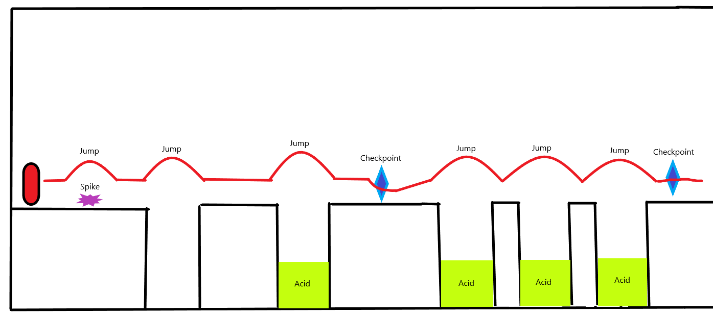
```

Example:


## 1. Player Experience (~700 words)
Outline and justify how your level design facilitates the core player experience goals outlined in the assignment spec. Each section should be supported by specific examples and screenshots of your game encounters that highlight design choices made to facilitate that particular experience.

### 1.1. Discovery
What does the player learn? How does your encounter and broader level design facilitate learning in a way that follows good design practice?

The mechanics within my level design have been cleverly placed in order to provide an iterative learning of different mechanics and obstacles that ensures the player can discover different dynamics of the game so they can enjoy the level I have designed. Within section-1 of my level design the player is introduced with four key mechanics of the game; spikes, acid, moving platforms, and checkpoints. Spikes are used early in the game for the player to learn how to manuever around them since these are commonly used throughout the level-design (storyboard 2.1). This is followed by a pit of acid that promotes discovery, if the player falls into the acid pit they learn that touching acid will immediately kill you (storyboard 2.2), sending you back to the beginning. Checkpoints were shown to the player after they had died or completed the beginning spikes and acid. Teaching the player that their are check-points that can bring them back when dying(storyboard 2.3), instead of starting from the beginning like their first death (if they died). The fourth core mechanic is moving platforms allowing the player to discover that the terrain within the level-design can move (storyboard 2.4), making them more aware of their surroundings for potential out of screen moving-platforms to come their way at any moment, In the middle of section one there are a combination of mechanics, player uses a moving-platform over acid once again but with a pillar of spikes making the player learn that they have the ability to crouch under obstacles. The player then discovers a new pass-through platform that shows them a new way of going through floors getting past levels (storyboard 2.5). The player is given a hallway filled with spikes that they will need to carefully navigate through, at the end there there is a health-pickup given complimented with a key (storyboard 2.6 and 2.7). This teaches the player that if they get hurt they are able to heal back up furthermore after completing a challenging part of the map they are rewarded with a key, making the player now know there are keys hidden within these hard sections. Section two is where the player discovers spitters, making the player learn how to manuever around the projectiles they shoot (storyboard 2.8). After the player has encountered their first mob they are able to get a staff (storyboard 2.9) which is shortly followed by and introduction of chompers within section 2. The player is able to learn that they can either dodge of kill these chompers that try to attack them (storyboard 2.10). After the player completes section 2, section 3 introduces the gun since section 3 is more open space and has mobs at long distance, allowing the player to discover they are able to kill enemies from long distances rather than putting themselves at risk (storyboard 2.11).

### 1.2. Drama
What is the intensity curve? How does your design facilitate increasing yet modulating intensity, with moments of tension and relief? 

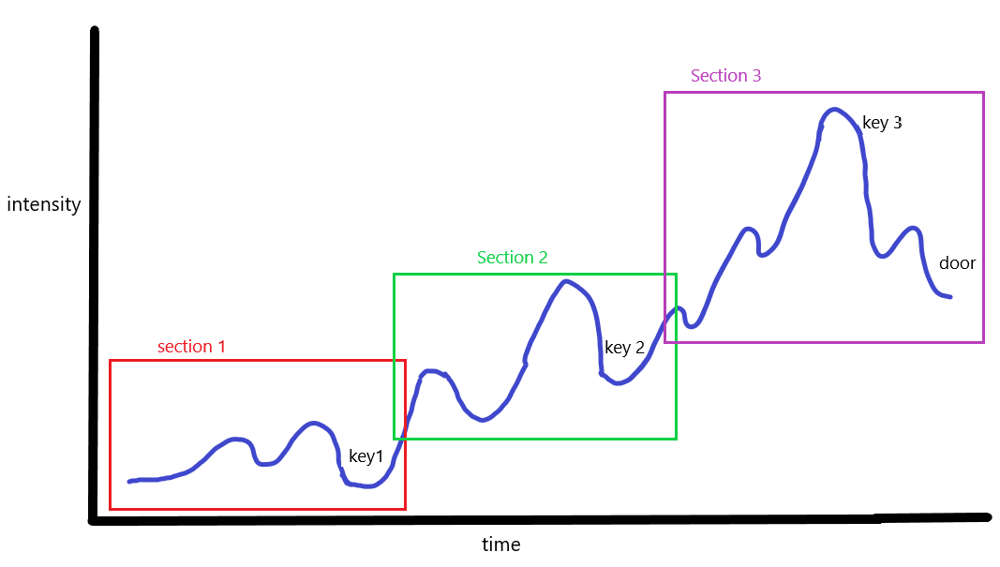

The start section 1 in my level-design consists introductions of simple mechanics like spikes and acid pits, these contribute to the drama by adding a factor of tension. Followed by moving-platforms over acid-pits which create more tension on players to time their jumps. This is complimented with a checkpoint that creates a sense of relief. A pass-through platform is used on top of a long drop to create anticipation within the player, as anything could lay ahead in the level. In the middle of section one the player uses a moving-platform over acid once again but with a pillar of spikes above their head adding that extra tension. Careful use of checkpoints provides the player relief with their dramatic arc when playing the game, these have celeverly been placed so that players don't get too frustrated in repeating large amounts of the map because fo dying. But also does not make it too easy for the player to die without consequences. Section 2 uses spitters and chompers in combination with mechanics from section 1 to increase the tension when completing particular parts of the map. This has been complimented by the addition of a staff within section 2 that allows the player to defend themselves from these different mobs. Section 3 is a bigger open spaced section that has a gun to provide a sense of relief as the player unlocks the ability to kill enemies from long distances. These mechanis have been used carefully to create a dramatic arc that is not too boring but not too hard mixing both tension and relief to be emitted from each mechanic.

### 1.3. Challenge
What are the main challenges? How have you designed and balanced these challenges to control the difficulty curve and keep the player in the flow channel?

The main challenges of my level design incorporated variety of available mechanics in order to challenge the player and test their skills in completing each section. At half-way towards the end of section one there is a platofrm moving over acid that has a ipllar of spikes above, forcing the player to act quick in crouching to avoid the obstacle. This is followed with a hallway of spikes to test the players skill of manuevering through tight spaces. In section two the introduction of spitters provided a challenge for the players to adapt to spitter projecticles and dodge them. This is followed by chompers that were introduced right after the player would acuqire a staff, challenging the players by testing their capability in killing chompers and spitters, whilst dodging their attacks. Section 3 of the level design created a challenge in finding the key as there was more open space along with a combination of every mechanic from the previous sections to create a more challenging and enjoyable experience when completing the level.

### 1.4. Exploration
How does your level design facilitate autonomy and invite the player to explore? How do your aesthetic and layout choices create distinct and memorable spaces and/or places?

Section 1 creates a forward-driven exploration with only one path to go this is done so that the player HAS to go through certain mechanics in order to learn the game. Section 2 has a small room / cave, which has the pickup-staff mechanic hidden in, it is covered by the pass-through platform to entice the player in adventuring into the small room. Section 3 has majority of its level-design based on exploration, as the section is more open-space and there are different routes you can go leading to dead-ends with items, the door, or the last key needed. While being riddled with variety of obstacles using key mechanics.

## 2. Core Gameplay (~400 words)
A section on Core Gameplay, where storyboards are used to outline how you introduce the player to each of the required gameplay elements in the first section of the game. Storyboards should follow the format provided in lectures.

Storyboards can be combined when multiple mechanics are introduced within a single encounter. Each section should include a sentence or two to briefly justify why you chose to introduce the mechanic/s to the player in that sequence.

You should restructure the headings below to match the order they appear in your level.

### 2.1. Spikes
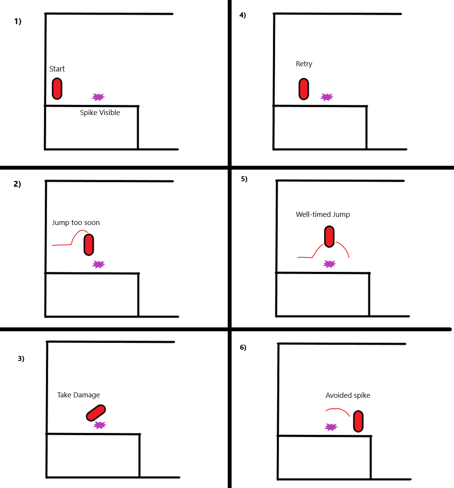
The spikes were introduced in the beginning of section 1 in my Level Design. This is done because spikes are a basic obstacle that the player should get used to as they will be seeing them more commonly while progressing through the level.

### 2.2. Acid
Use this storyboard for 2.2 and 2.3:
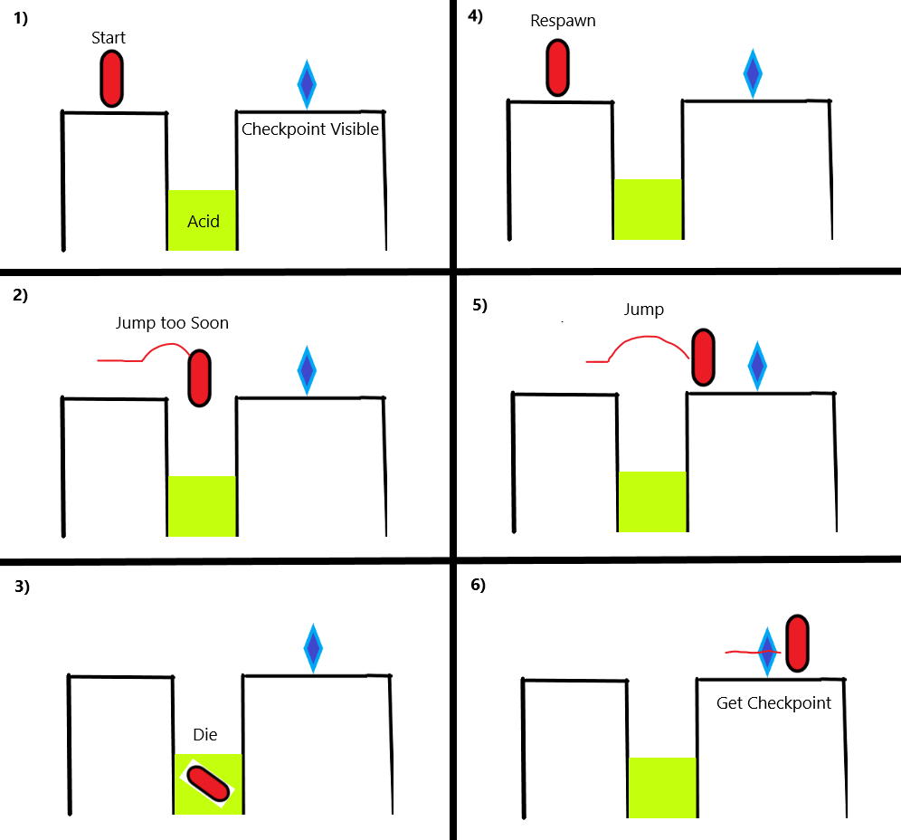
The player encounters acid in section 1 of the Level Design. It is introduced early so that the player can learn how to maneuver around this obstacle as it is commonly used within the rest of my Level Design.  

### 2.3. Checkpoints
(For storyboard refer to 2.2 Acid Storyboard which contains checkpoint as well.)
Checkpoints are the third mechanic introduced, so that players know their wont be put back to the beginning when failing an obstacle. Checkpoints have been cleverly placed within Section 1-3 of the level design, so that players are given a sense of relief.

### 2.4. Moving Platforms
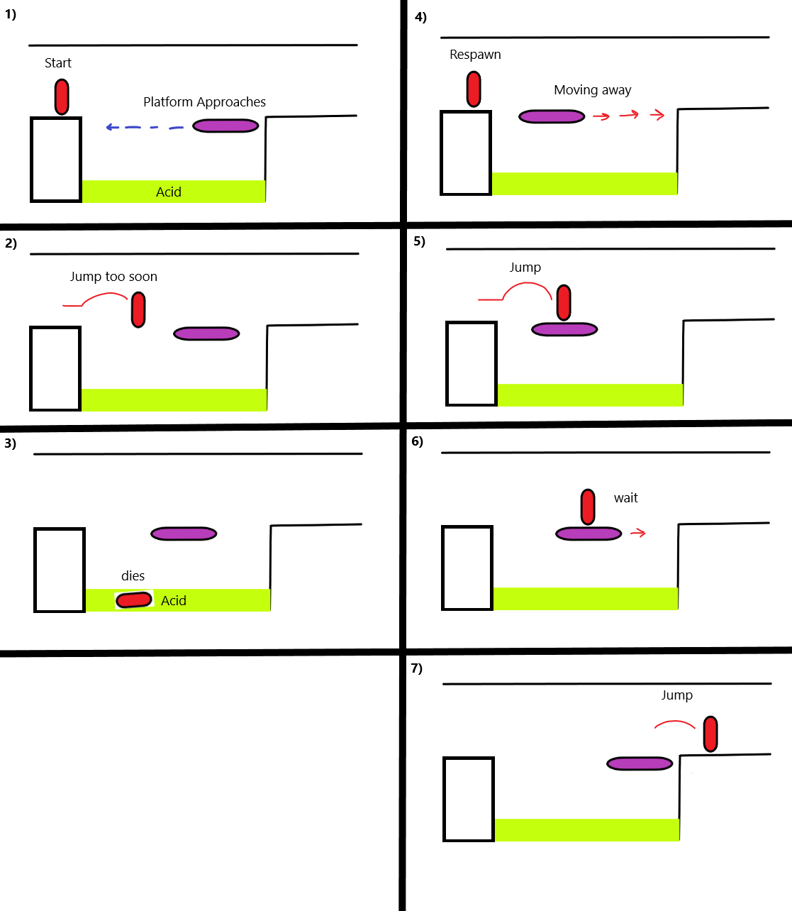
Moving platforms were the fourth Mechanic in section 1 of my level design. This was introduced with a combination of acid, the player would not be able to jump over a big acid pit, but because there are now moving platforms the player is able to get across safely.

### 2.5. Passthrough Platforms
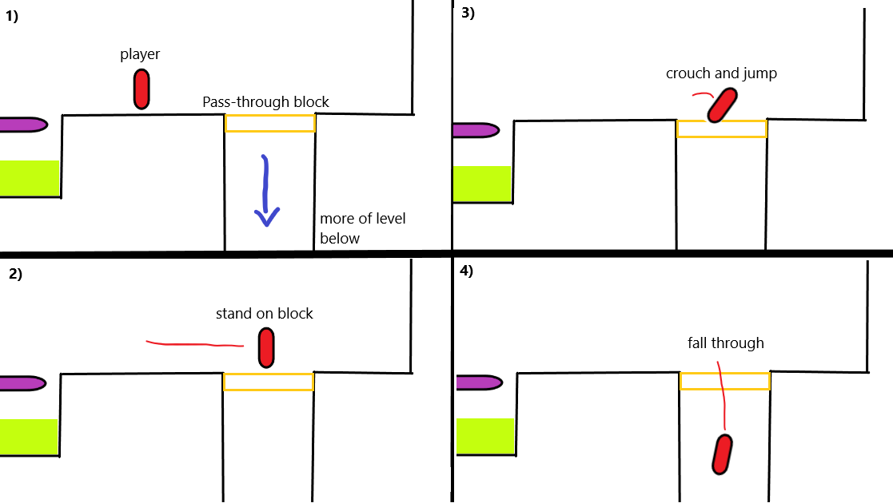
Passthrough platforms were the fifth mechanic introduced within the Seciton 1 of my level design. The passthrough platform was placed over a hole so the player was able to know that they were meant to go down in order to progress through the level.

### 2.6. Health Pickups
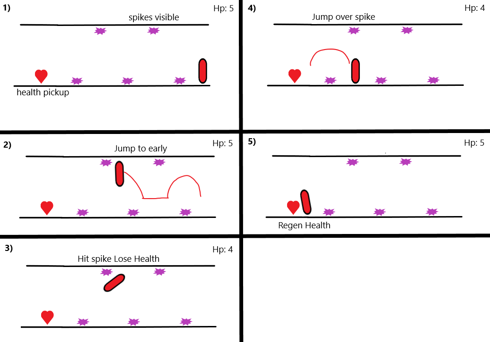
Health pickups have been introduced in the middle and at the end of section one. The story board above shows the health-pickup at the end of section 1. It is placed after the player has completed a challenging hallway covered in spikes. In a scenario where the player hit the spikes, they would be able to heal up after completing the challenging hallway. 

### 2.7. Keys
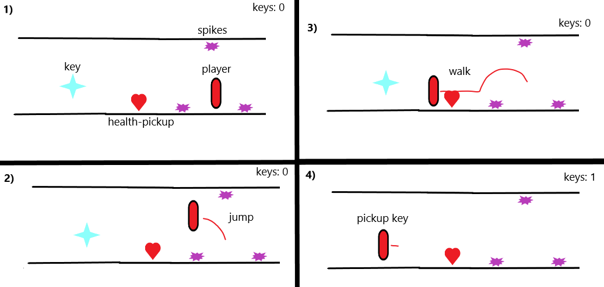
The seventh mechanic were keys. There are 3 keys so I have placed 1 in each section. The players first encounter a key at the end of section 1 to provide a sense of triumph because they have gotten past difficult obstacles and been rewarded with a key.

### 2.8. Spitters
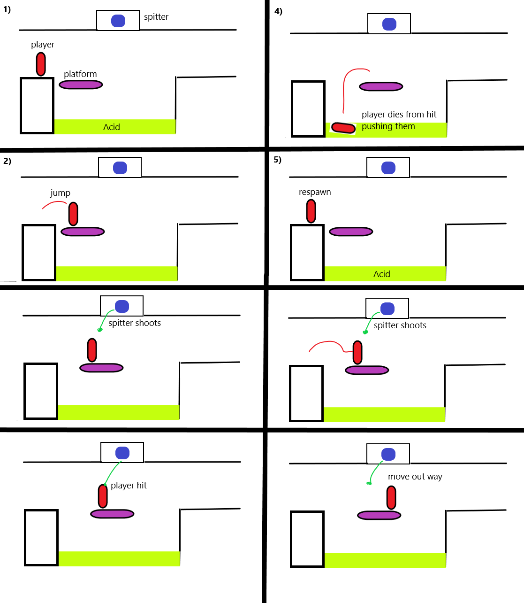
Spitters are the eight mechanic introduced to the player in Section 2. The player would have to go across a moving platform over acid while a spitter was shooting at them. This made the player learn how to dodge spitters while also being on the move.

### 2.9. Weapon Pickup (Staff)
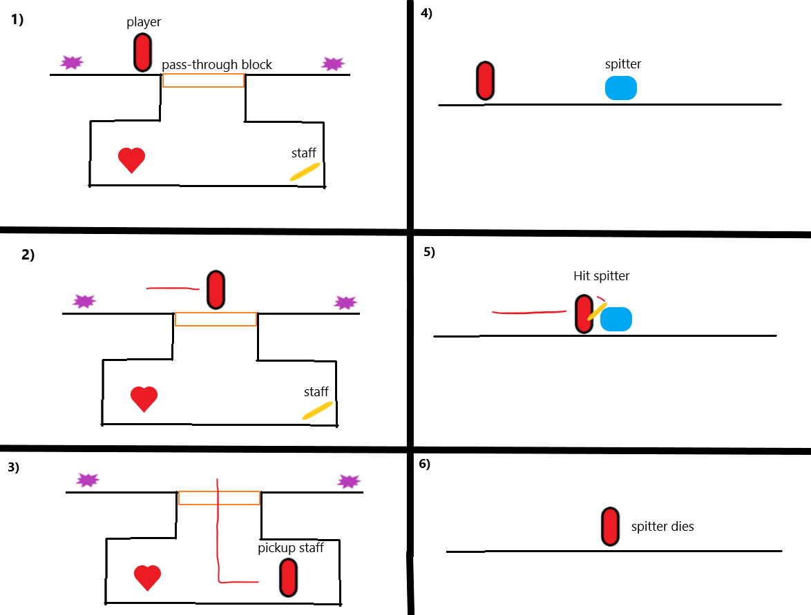
The weapon pickup staff was the ninth mechanic. Once the player acquired the Staff they were now able to defend themselves from Spitters and the next mechanic.

### 2.10. Chompers
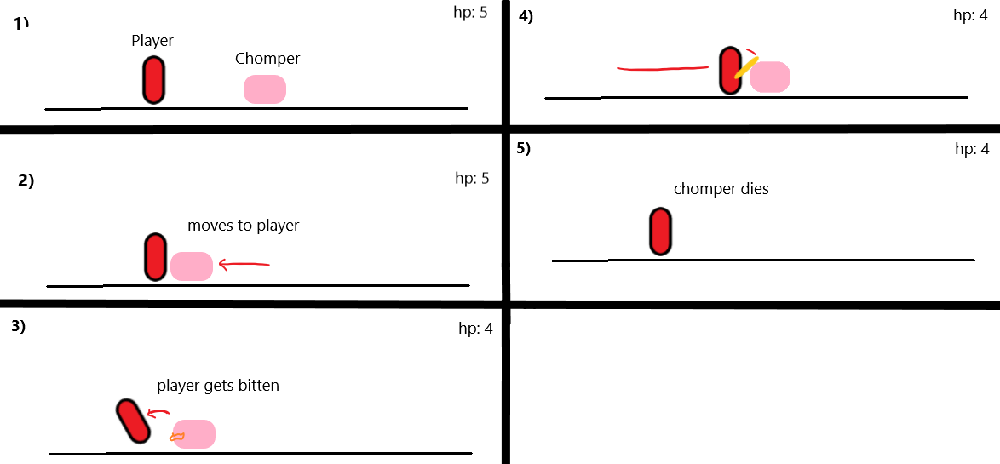
Chompers were introduced after the player was able to get the staff. This enabled to player to learn how to chomper works, making the player learn how to dodge them or use the staff to kill the chompers.

### 2.11. Weapon Pickup (Gun)
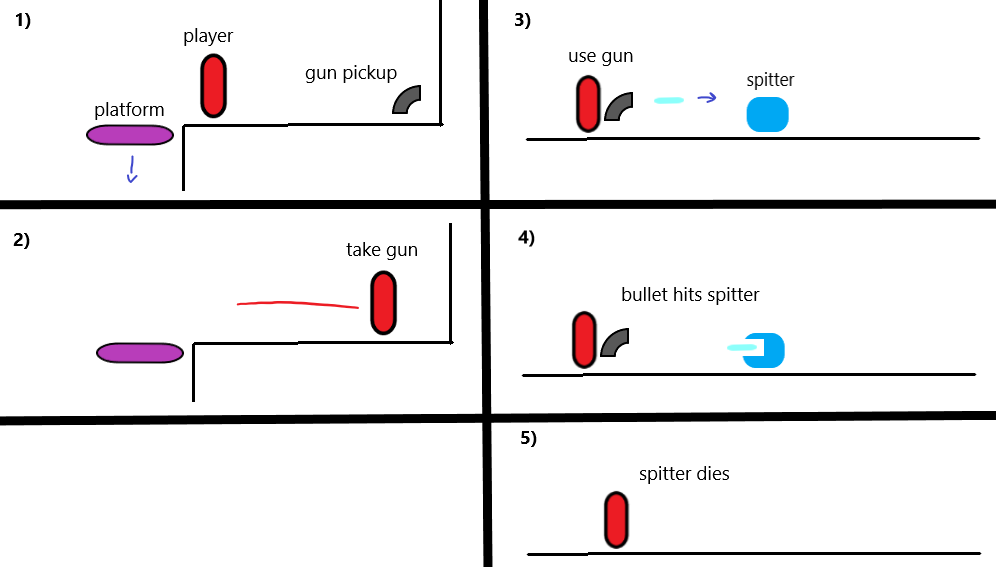
The gun was introduced in the third section of the level, this enabled to the player to use long range moves to kill enemies. The third section of the map is very open and this compliments the use of a gun.


## 3. Spatiotemporal Design
A section on Spatiotemporal Design, which includes your molecule diagram and annotated level maps (one for each main section of your level). These diagrams may be made digitally or by hand, but must not be created from screenshots of your game. The annotated level maps should show the structure you intend to build, included game elements, and the path the player is expected to take through the level. Examples of these diagrams are included in the level design lectures.

No additional words are necessary for this section (any words should only be within your images/diagrams).
 
### 3.1. Molecule Diagram

### 3.2. Level Map – Section 1
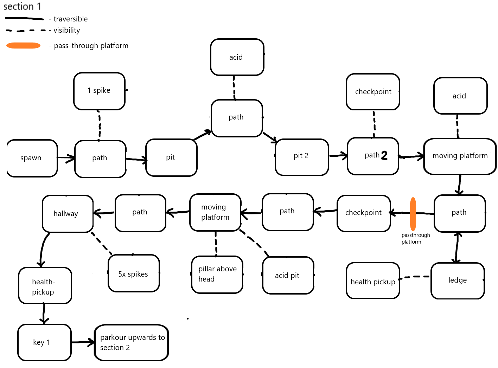

### 3.3. Level Map – Section 2
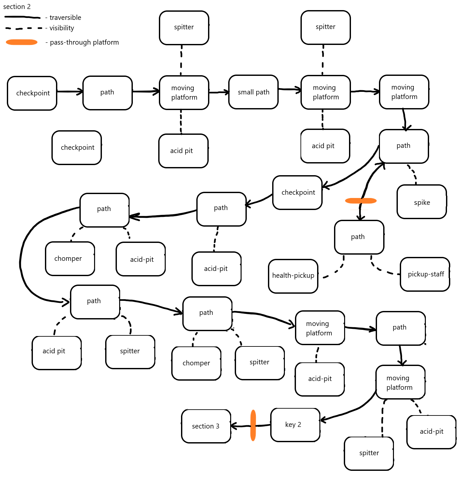

### 3.4. Level Map – Section 3
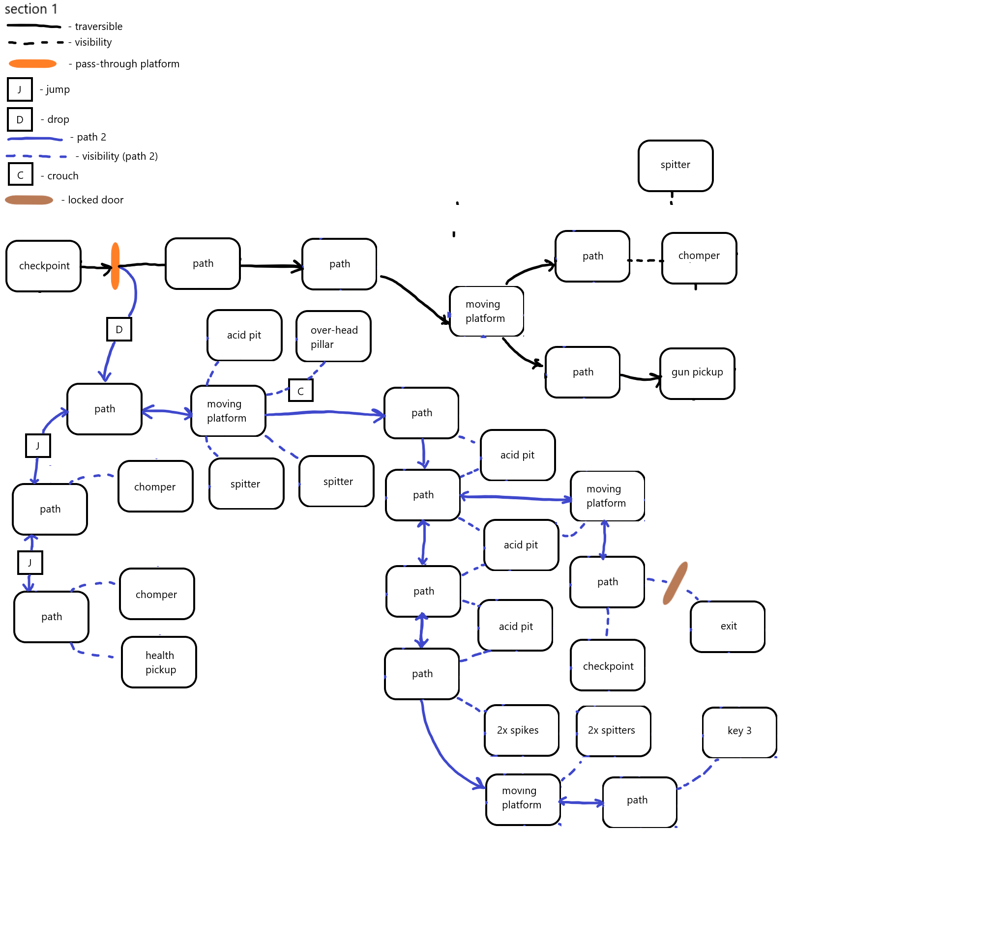

## 4. Iterative Design (~400 words)
Reflect on how iterative design helped to improve your level. Additional prototypes and design artefacts should be included to demonstrate that you followed an iterative design process (e.g. pictures of paper prototypes, early grey-boxed maps, additional storyboards of later gameplay sequences, etc.). You can also use this section to justify design changes made in Unity after you drew your level design maps shown in section 3. 

You should conclude by highlighting a specific example of an encounter, or another aspect of your level design, that could be improved through further iterative design.

Viewing over the level design I have created

## Generative AI Use Acknowledgement

Use the below table to indicate any Generative AI or writing assistance tools used in creating your document. Please be honest and thorough in your reporting, as this will allow us to give you the marks you have earnt. Place any drafts or other evidence inside this repository. This form and related evidence do not count to your word count.
An example has been included. Please replace this with any actual tools, and add more as necessary.


### Tool Used: ChatGPT
**Nature of Use** Finding relevant design theory.

**Evidence Attached?** Screenshot of ChatGPT conversation included in the folder "GenAI" in this repo.

**Additional Notes:** I used ChatGPT to try and find some more relevant design theory that I could apply to my game. After googling them, however, I found most of them were inaccurate, and some didn't exist. One theory mentioned, however, was useful, and I've incorporated it into my work.

### Tool Used: Example
**Nature of Use** Example Text

**Evidence Attached?** Example Text

**Additional Notes:** Example Text


